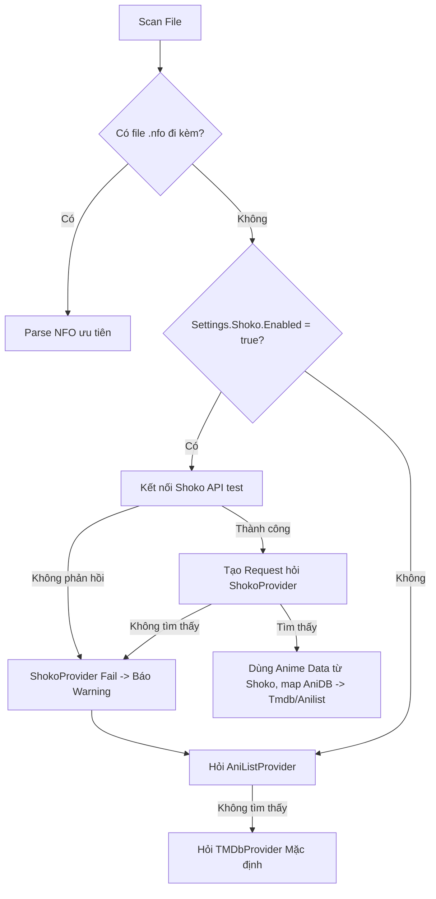

# Specification: Shoko (AniDB) Integration in Velox (Option A)

## 1. Executive Summary
Tích hợp Shoko Server (hệ thống metadata anime mã nguồn mở sử dụng AniDB) vào quá trình quét (scan) thư viện của Velox để hỗ trợ độ chính xác cao đối với nội dung anime (đặc biệt là Absolute Order, OVAs, Specials). Shoko sẽ hoạt động như một tính năng tuỳ chọn (optional integration), đảm bảo luồng mặc định dựa vào NFO, AniList và TMDb vẫn chạy mượt mà đối với người dùng thông thường.

## 2. User Stories
- **Người dùng phổ thông**: Không cần cấu hình gì thêm. Các tập anime vẫn scan qua AniList và TMDb như trước (với sự chính xác ở mức độ khá).
- **Người dùng hệ Anime (Power Users)**: Có thể bật "Shoko Integration" trên Settings. Velox sẽ hỏi Shoko Server trước xem tập file này thuộc Anime nào, từ đó trích xuất được đúng thông tin chính xác 100% dựa vào AniDB hash.
- **Admin**: Thấy hệ thống log ra nếu API của Shoko gặp sự cố, nhưng cả pipeline scan không bao giờ bị đứng mạng vì quá trình quét sẽ fallback (lùi) ngay lập tức về AniList API.

## 3. Database Design
Bổ sung các trường vào bảng hiện có:
- Entity Media (Movie, Series, Episode): 
  - `anidb_id` (Tương đương ID của Shoko / AniDB)
  - `anilist_id`
- Settings (Application config):
  - `integrations.shoko.enabled` (Boolean)
  - `integrations.shoko.endpoint` (String)
  - `integrations.shoko.api_key` (String)

## 4. Logic Flowchart

## 5. API Contract
Sẽ sử dụng các API endpoints của Shoko Server (V3):
- Auth: `POST /api/auth`
- File info: `GET /api/v3/File/Path?...` (để query chính xác title từ đường dẫn thư mục).
- Backup: Search by Title trên Shoko.

## 6. Architecture & Tech Stack
- Refactor module `metadata/matcher.go` thành Interface: `IMetadataProvider`.
- Áp dụng Chain of Responsibility để rớt dần từ: NFO -> Shoko -> AniList -> TMDb.

## 7. Build Checklist
- [ ] Kiến trúc hóa đống logic cũ của Matcher.
- [ ] Xây AniList Provider.
- [ ] Đẩy database / settings interface lên DB.
- [ ] Xây Shoko Provider.
- [ ] Test Edge Cases (File name lệch, api sập mạng,...).
